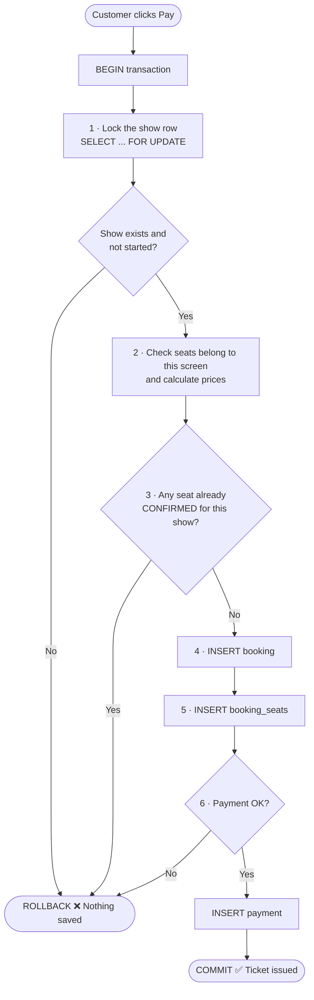
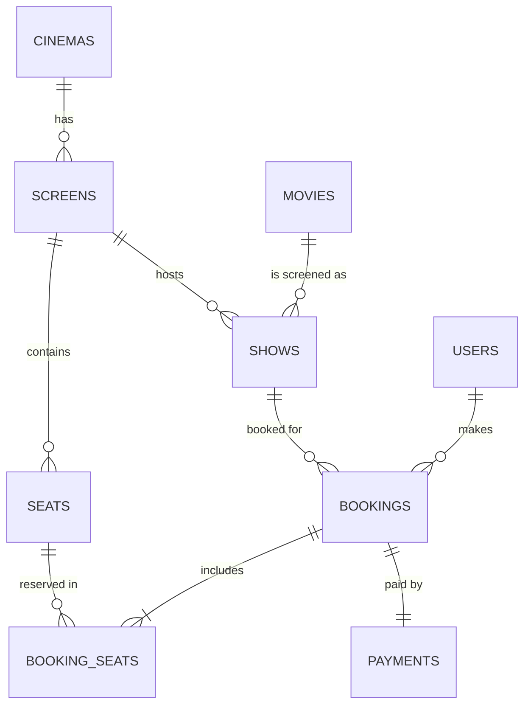

<div align="center">

# 🎬 CineBook — Cinema Ticket Booking System

### *Pick a movie. Pick your seat. Never get double-booked.*


A desktop app where **customers** browse movies, pick seats on a cinema-hall seat map and pay,
while **admins** run the whole cinema and watch the revenue roll in.
Built as a **DBMS mini-project** to show real database concepts working inside a real app.

</div>

---

## 📖 Table of Contents

1. [What is this?](#-what-is-this)
2. [Features](#-features)
3. [Tech stack](#-tech-stack)
4. [Quick start](#-quick-start-5-steps)
5. [Demo logins](#-demo-logins)
6. [How a booking works](#-how-a-booking-works-the-clever-part)
7. [Database design](#-database-design)
8. [Project structure](#-project-structure)
9. [Where each DBMS concept lives](#-where-each-dbms-concept-lives)
10. [Viva demo script](#-viva-demo-script-5-minutes)
11. [Admin reports](#-admin-reports)
12. [Troubleshooting](#-troubleshooting)
13. [Known limitations & ideas](#-known-limitations--ideas)

<p align="center">
  
</p>

---

## 🍿 What is this?

Imagine two people click on seat **F5** for the same show at the same moment. In a badly built
system, both get a ticket and an argument starts at the theatre door.

**CineBook makes sure that never happens.** Every booking is saved as *one all-or-nothing
transaction*, protected by row locking and a database trigger. If anything goes wrong — a seat
is taken, payment fails — the database rolls back and nothing is half-saved.

Around that core sits a full application: a poster-style movie browser, an interactive seat map,
a ticket confirmation screen, booking history with cancellation and refund, and an admin console
with SQL-powered reports.

---

## ✨ Features

### 🧑‍🎤 For customers
| Feature | What you get |
|---|---|
| **Register / Login** | Validated sign-up (email format, 10-digit phone, min 6-char password) |
| **Browse & Book** | Poster grid with genre and city filters, a date strip, and showtimes grouped by cinema with live **"seats left"** badges |
| **Seat map** | Dark cinema hall, curved screen, aisle, Regular and Premium zones with prices, hover / selected / booked states |
| **Live updates** | Booked seats refresh automatically every 5 seconds while the seat window is open |
| **Payment** | Simulated checkout (Card / UPI / Net Banking) with a *Simulate payment failure* switch for demos |
| **Ticket screen** | Confirmation ticket right after payment |
| **My Bookings** | Full history; cancel a future show and the payment is marked **REFUNDED** |

### 📸 Screenshots

**1 · Browse & Book** — poster grid, filters, date strip and showtimes with live seats-left badges
<p align="center"></p>

**2 · Seat map** — pick your seats; Regular and Premium zones are priced, selected seats glow red
<p align="center"></p>

**3 · Ticket confirmation** — your booking is saved in one transaction and the ticket appears
<p align="center"></p>

### 🛠️ For admins
- **Dashboard** with KPIs (customers, bookings, revenue, movies) and **6 SQL reports** — the actual SQL is shown next to the results
- **Full CRUD** tabs: Movies · Cinemas · Screens · Seats · Shows · Users · Bookings
- Foreign keys protect your data, e.g. you **can't delete a movie that still has shows**

### 🤖 Behind the scenes
- **Shows never run dry:** `ShowScheduler` tops up the timetable for the next ~10 days on every start (past shows are hidden automatically)
- **Generated posters:** no image files needed — `Poster.java` paints a unique gradient poster from each movie title
- **Clock-safe:** show times are compared against your PC clock and read as `LocalDate` / `LocalTime`, so DB-server time zones can't hide or shift shows

---

## 🧰 Tech stack

| Layer | Technology |
|---|---|
| Language | Java 17+ |
| GUI | Swing with **FlatLaf** 3.4.1 look & feel |
| Database | MySQL 8 (InnoDB) |
| Connectivity | JDBC — MySQL Connector/J 8.4.0 |
| Build | Maven (shade plugin builds a runnable fat jar) |
| Architecture | Layered: **model → DAO → service → UI** |

---

## 🚀 Quick start (5 steps)

**1. Install** JDK 17+, Maven and MySQL 8.

**2. Create the database** *(re-run any time to reset — it recreates `cinema_db`)*
```bash
mysql -u root -p < database/schema.sql
mysql -u root -p < database/seed.sql
```

**3. Set your DB credentials** (defaults: user `root`, empty password, `localhost:3306`)

| OS | Command |
|---|---|
| Windows (cmd) | `set CINEMA_DB_USER=root` then `set CINEMA_DB_PASSWORD=yourpassword` |
| Linux / macOS | `export CINEMA_DB_PASSWORD=yourpassword` |
| IntelliJ / Eclipse | Add them as environment variables in the Run Configuration of `Main` |

Optional: `CINEMA_DB_URL` lets you supply a full JDBC URL.

**4. Run it**
```bash
mvn compile exec:java
```
(or open the folder as a Maven project in your IDE and run `Main`)

**5. Build a runnable jar**
```bash
mvn package
java -jar target/cinema-booking-1.0.jar
```

---

## 🔑 Demo logins

| Role | Email | Password |
|---|---|---|
| 👑 Admin | `admin@cinema.com` | `admin123` |
| 🎟️ Customer | `rahul@mail.com` | `user123` |

Other seeded customers (all password `user123`): `priya@mail.com`, `amit@mail.com`, `sneha@mail.com`.

---

## ⚙️ How a booking works (the clever part)

`BookingService.book()` runs everything as **one transaction**:



### 🛡️ Three layers of double-booking defence

| # | Layer | How it works |
|---|---|---|
| 1 | **Row lock** | `SELECT … FOR UPDATE` on the show row makes simultaneous bookings of the same show queue up one by one |
| 2 | **Availability check** | Inside that lock, seats are re-checked against confirmed bookings — so the answer can't change under you |
| 3 | **Database trigger** | `trg_prevent_double_booking` rejects a duplicate seat even if someone bypasses the app and inserts SQL directly |

### 💰 Pricing
Each show has a base price. **Premium seats (rows F, G, H) cost 1.5×** the Regular price.
You can book **up to 10 seats** at once.

---

## 🗄️ Database design

A **3NF** schema with 9 tables, 2 views, 4 secondary indexes and 1 trigger.



*(Full diagram with every column: [`docs/ER_Diagram.md`](docs/ER_Diagram.md))*

| Table | Purpose | Notable rules |
|---|---|---|
| `users` | Customers and admins | `email` UNIQUE, `role` ENUM, password stored as SHA-256 hash |
| `movies` | Movie catalogue | `title` UNIQUE, `CHECK (duration_min > 0)` |
| `cinemas` | Cinema branches | UNIQUE (`name`, `city`) |
| `screens` | Halls inside a cinema | UNIQUE (`cinema_id`, `screen_name`), cascades on cinema delete |
| `seats` | Physical seats | UNIQUE (`screen_id`, row, number), type REGULAR / PREMIUM |
| `shows` | A movie on a screen at a time | UNIQUE (`screen_id`, date, time) — one screen can't run two shows at once; `ON DELETE RESTRICT` |
| `bookings` | Booking header | status CONFIRMED / CANCELLED |
| `booking_seats` | Seats in each booking | **Composite PK** (`booking_id`, `seat_id`) |
| `payments` | One payment per booking | `booking_id` UNIQUE; status SUCCESS / FAILED / REFUNDED |

**Views:** `v_show_details` (show + movie + cinema + screen in one row) and
`v_revenue_by_movie` (bookings, tickets and revenue per movie).

### 🌱 Seed data
12 movies (Inception, Interstellar, 3 Idiots, The Dark Knight, Dangal, Spirited Away, Oppenheimer, RRR, Coco, Gully Boy, Kantara, Top Gun: Maverick) · 4 cinemas across Pune, Mumbai and Nashik · 8 screens, each with **80 seats** (rows A–H × 10) · 5 users · sample bookings so reports have data from day one.

---

## 📁 Project structure

```
cinema_booking/
├── pom.xml
├── README.md
├── REPORT.md                  ← written project report
├── database/
│   ├── schema.sql             ← tables, views, indexes, trigger
│   ├── seed.sql               ← demo data
│   └── queries.sql            ← SQL showcase (joins, subqueries, transactions…)
├── docs/
│   ├── ER_Diagram.md          ← Mermaid ER diagram
│   └── screenshots/           ← images used in this README
└── src/main/java/
    ├── Main.java              ← entry point: connect → top up shows → open login
    ├── model/                 ← records: User, Movie, Cinema, Screen, Seat, Show, Booking
    ├── dao/                   ← JDBC data access (Movie, Cinema, Screen, Seat,
    │                            Show, User, Booking, Report)
    ├── service/
    │   ├── BookingService     ← the transactional booking + cancel logic
    │   ├── AuthService        ← login / registration validation
    │   ├── ShowScheduler      ← auto-generates upcoming shows
    │   └── BookingException
    ├── ui/                    ← Swing screens
    │   ├── LoginFrame · RegisterDialog
    │   ├── CustomerFrame · BrowsePanel · SeatDialog · PaymentDialog
    │   │   · TicketDialog · MyBookingsPanel
    │   └── AdminFrame · AdminPanels · CrudPanel · ReportsPanel · FormDialog
    └── util/                  ← Db (JDBC helper), Theme, Poster, Passwords, Table
```

**Layering in one line:** *UI* asks a *service* → the service uses *DAOs* → DAOs talk to MySQL through `Db`.
UI code never writes SQL directly.

---

## 🧠 Where each DBMS concept lives

| Concept | Location |
|---|---|
| PK / FK / UNIQUE / NOT NULL / CHECK, composite key | `database/schema.sql` (`booking_seats` PK = `booking_id` + `seat_id`) |
| Views | `v_show_details`, `v_revenue_by_movie` |
| Indexes | `idx_show_movie_date`, `idx_booking_user`, `idx_booking_show_status`, `idx_bs_seat` |
| Trigger (extra safety) | `trg_prevent_double_booking` |
| JOIN / GROUP BY / HAVING / subqueries | `ReportDao.java`, `database/queries.sql` |
| Transactions, COMMIT / ROLLBACK, row locking | `BookingService.java` |
| Referential integrity (`RESTRICT`, `CASCADE`) | `schema.sql` foreign keys |
| CRUD | `dao/*` + Admin tabs |

---

## 🎤 Viva demo script (5 minutes)

1. **Customer flow** — Log in as Rahul → search "sci" → pick a show → select seats → pay → see the ticket → open *My Bookings*.
2. **Double booking** — Run the app **twice**, open the same show in both windows, select the same seat in both, pay in window A, then pay in window B → B gets *"already booked"*.
3. **Rollback** — Tick *Simulate payment failure* in the payment dialog → the booking and seats are **not** saved (check *My Bookings* or `SELECT * FROM bookings;`).
4. **Admin** — Log in as admin → Dashboard shows KPIs and 6 reports **with the SQL used**. Try deleting a movie that has shows → blocked by the foreign key.
5. **SQL** — Open `database/queries.sql` and run it section by section.

---

## 📊 Admin reports

| Report | SQL concepts shown |
|---|---|
| Revenue by movie | 4-table JOIN, `GROUP BY`, `SUM`, `COUNT DISTINCT` |
| Revenue by cinema | 5-table JOIN, `GROUP BY` |
| Daily revenue | `GROUP BY DATE(...)` |
| Popular movies | `HAVING COUNT(...) >= 2` |
| Top customers | `HAVING` with a nested **subquery** (spent above average) |
| Seat occupancy per show | View + `LEFT JOIN` + correlated subqueries |

---

## 🩺 Troubleshooting

| Problem | Fix |
|---|---|
| **"Cannot connect to MySQL"** popup | Make sure MySQL is running, you ran both `schema.sql` and `seed.sql`, and the `CINEMA_DB_*` variables are set |
| `Access denied for user 'root'` | Set `CINEMA_DB_PASSWORD` to your real MySQL password |
| IDE can't find `Main` | Open the folder as a **Maven** project and let it download dependencies |
| No shows visible | Restart the app — `ShowScheduler` regenerates the next ~10 days on startup |
| Want a fresh start | Re-run `schema.sql` then `seed.sql` (this wipes and recreates `cinema_db`) |

---

## 🔭 Known limitations & ideas

This is a learning project, so a few things are deliberately simple:

- **Payment is simulated** — no real gateway.
- **Passwords use plain SHA-256** (no salt). Fine for a demo; a real system should use bcrypt or Argon2.
- **Desktop only** — there is no web or mobile front-end.

Ideas to extend it:
- 💳 Plug in a real payment gateway
- 📧 Email the ticket with a QR code
- ⏳ Temporary seat holds (e.g. 5 minutes) while the customer pays
- 🌐 Move the service layer behind a REST API (Spring Boot) with a web front-end
- 🎟️ Coupons, food combos, and seat categories beyond Regular / Premium

---

<div align="center">

**Built with ☕, Swing and a lot of `FOR UPDATE`.**
*Grab your popcorn — and your seat. 🍿*

</div>
