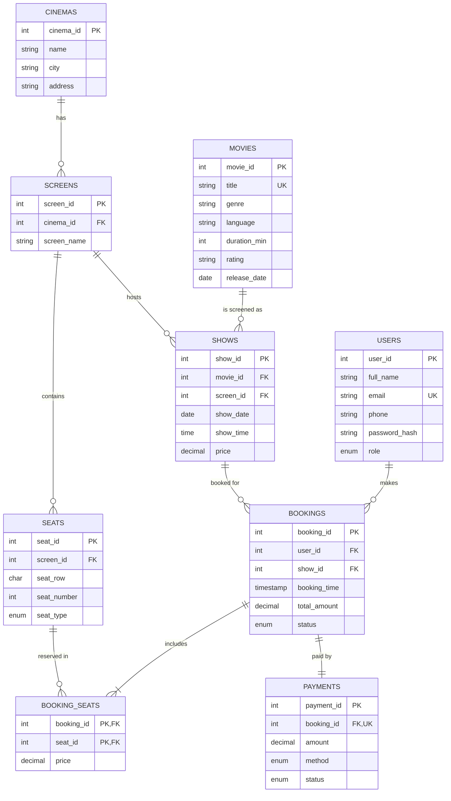

# ER Diagram (Mermaid)
Paste into https://mermaid.live or view in any Markdown viewer that supports Mermaid (GitHub, VS Code preview).

```mermaid
erDiagram
    USERS ||--o{ BOOKINGS : makes
    MOVIES ||--o{ SHOWS : "is screened as"
    CINEMAS ||--o{ SCREENS : has
    SCREENS ||--o{ SEATS : contains
    SCREENS ||--o{ SHOWS : hosts
    SHOWS ||--o{ BOOKINGS : "booked for"
    BOOKINGS ||--|{ BOOKING_SEATS : includes
    SEATS ||--o{ BOOKING_SEATS : "reserved in"
    BOOKINGS ||--|| PAYMENTS : "paid by"

    USERS { int user_id PK
            string full_name
            string email UK
            string phone
            string password_hash
            enum role }
    MOVIES { int movie_id PK
             string title UK
             string genre
             string language
             int duration_min
             string rating
             date release_date }
    CINEMAS { int cinema_id PK
              string name
              string city
              string address }
    SCREENS { int screen_id PK
              int cinema_id FK
              string screen_name }
    SEATS { int seat_id PK
            int screen_id FK
            char seat_row
            int seat_number
            enum seat_type }
    SHOWS { int show_id PK
            int movie_id FK
            int screen_id FK
            date show_date
            time show_time
            decimal price }
    BOOKINGS { int booking_id PK
               int user_id FK
               int show_id FK
               timestamp booking_time
               decimal total_amount
               enum status }
    BOOKING_SEATS { int booking_id PK,FK
                    int seat_id PK,FK
                    decimal price }
    PAYMENTS { int payment_id PK
               int booking_id FK,UK
               decimal amount
               enum method
               enum status }
```
